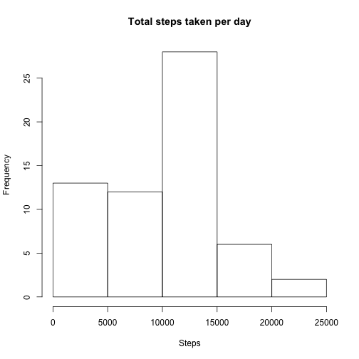
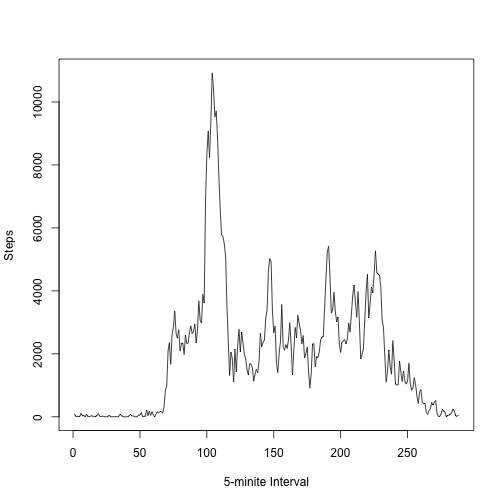
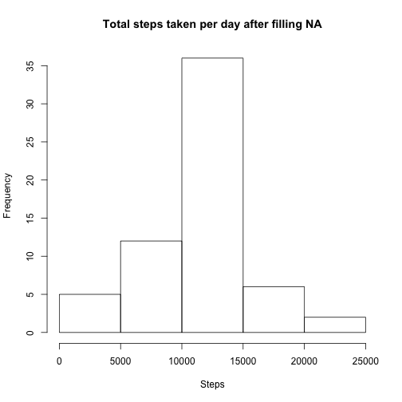
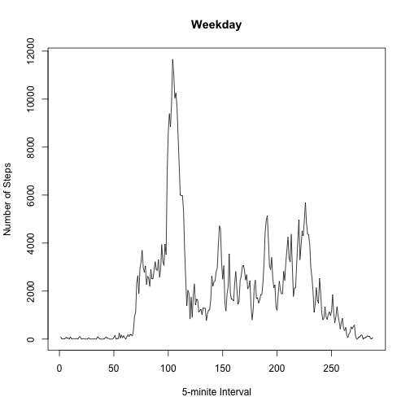
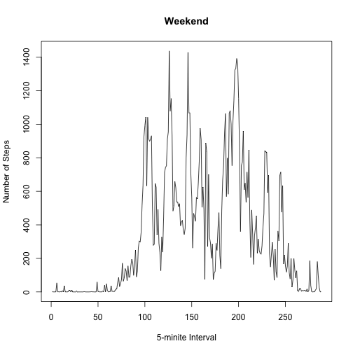

---
title: "Peer Assignment 1"
output: html_document
---

## Loading and pre-processing data

```r
mydata = read.csv(file = "activity.csv", head=TRUE, sep=",")
summary(mydata)
```

```
##      steps                date          interval     
##  Min.   :  0.00   2012-10-01:  288   Min.   :   0.0  
##  1st Qu.:  0.00   2012-10-02:  288   1st Qu.: 588.8  
##  Median :  0.00   2012-10-03:  288   Median :1177.5  
##  Mean   : 37.38   2012-10-04:  288   Mean   :1177.5  
##  3rd Qu.: 12.00   2012-10-05:  288   3rd Qu.:1766.2  
##  Max.   :806.00   2012-10-06:  288   Max.   :2355.0  
##  NA's   :2304     (Other)   :15840
```

## What is mean total number of steps taken per day?

```r
library(plyr)
cdata = ddply(mydata, c("date"), summarise, steps=sum(steps, na.rm=TRUE))
summary(cdata)
```

```
##          date        steps      
##  2012-10-01: 1   Min.   :    0  
##  2012-10-02: 1   1st Qu.: 6778  
##  2012-10-03: 1   Median :10395  
##  2012-10-04: 1   Mean   : 9354  
##  2012-10-05: 1   3rd Qu.:12811  
##  2012-10-06: 1   Max.   :21194  
##  (Other)   :55
```

```r
mean_steps = mean(cdata$steps)
median_steps = median(cdata$steps)
hist(cdata$steps, main ="Total steps taken per day", xlab = "Steps")
```

 

```r
print(mean_steps)
```

```
## [1] 9354.23
```

```r
print(median_steps)
```

```
## [1] 10395
```

## What is the average daily activity pattern?

```r
library(plyr)
ddata = ddply(mydata, c("interval"), summarise, sum_steps=sum(steps, na.rm=TRUE), mean=mean(steps, na.rm=TRUE))
summary(ddata)
```

```
##     interval        sum_steps            mean        
##  Min.   :   0.0   Min.   :    0.0   Min.   :  0.000  
##  1st Qu.: 588.8   1st Qu.:  131.8   1st Qu.:  2.486  
##  Median :1177.5   Median : 1808.0   Median : 34.113  
##  Mean   :1177.5   Mean   : 1981.3   Mean   : 37.383  
##  3rd Qu.:1766.2   3rd Qu.: 2800.2   3rd Qu.: 52.835  
##  Max.   :2355.0   Max.   :10927.0   Max.   :206.170
```

```r
plot(ddata$sum_steps, type="l", xlab="5-minite Interval", ylab="Steps")
```

 

```r
print(max(ddata$sum_steps))
```

```
## [1] 10927
```

## Imputing missing values

```r
library(plyr)
# calculate the total number of missing vlaues in the dataset
missing_data = subset(mydata, is.na(steps))
print (nrow(missing_data))
```

```
## [1] 2304
```

```r
# filling all missing values with mean for that 5-minute interval.
edata = merge(mydata, subset(ddata, select=c("interval","mean")), by="interval")
for(i in 1:nrow(edata)){
  if (is.na(edata$steps[i]) == TRUE) {
    edata$steps[i] = edata$mean[i]
  }
}
edata = subset(edata, select=c("steps", "date", "interval"))
summary(edata)
```

```
##      steps                date          interval     
##  Min.   :  0.00   2012-10-01:  288   Min.   :   0.0  
##  1st Qu.:  0.00   2012-10-02:  288   1st Qu.: 588.8  
##  Median :  0.00   2012-10-03:  288   Median :1177.5  
##  Mean   : 37.38   2012-10-04:  288   Mean   :1177.5  
##  3rd Qu.: 27.00   2012-10-05:  288   3rd Qu.:1766.2  
##  Max.   :806.00   2012-10-06:  288   Max.   :2355.0  
##                   (Other)   :15840
```

```r
# draw the histogram again
c2data = ddply(edata, c("date"), summarise, steps=sum(steps, na.rm=TRUE))
summary(c2data)
```

```
##          date        steps      
##  2012-10-01: 1   Min.   :   41  
##  2012-10-02: 1   1st Qu.: 9819  
##  2012-10-03: 1   Median :10766  
##  2012-10-04: 1   Mean   :10766  
##  2012-10-05: 1   3rd Qu.:12811  
##  2012-10-06: 1   Max.   :21194  
##  (Other)   :55
```

```r
mean_steps2 = mean(c2data$steps)
median_steps2 = median(c2data$steps)
hist(c2data$steps, main ="Total steps taken per day after filling NA", xlab = "Steps")
```

 

```r
print(mean_steps2)
```

```
## [1] 10766.19
```

```r
print(median_steps2)
```

```
## [1] 10766.19
```

## Are there differences in activity patterns between weekdays and weekends?

```r
library(plyr)
# add a new variable for weekday
edata$day <- as.factor(ifelse(weekdays(as.Date(edata$date)) %in% c("Staturday","Sunday"), "Weekend", "Weekday"))
summary(edata)
```

```
##      steps                date          interval           day       
##  Min.   :  0.00   2012-10-01:  288   Min.   :   0.0   Weekday:15264  
##  1st Qu.:  0.00   2012-10-02:  288   1st Qu.: 588.8   Weekend: 2304  
##  Median :  0.00   2012-10-03:  288   Median :1177.5                  
##  Mean   : 37.38   2012-10-04:  288   Mean   :1177.5                  
##  3rd Qu.: 27.00   2012-10-05:  288   3rd Qu.:1766.2                  
##  Max.   :806.00   2012-10-06:  288   Max.   :2355.0                  
##                   (Other)   :15840
```

```r
# plot the weekday and weekend
d2data = ddply(subset(edata, day=="Weekday"), c("interval"), summarise, sum_steps=sum(steps, na.rm=TRUE), mean=mean(steps, na.rm=TRUE))
d3data = ddply(subset(edata, day=="Weekend"), c("interval"), summarise, sum_steps=sum(steps, na.rm=TRUE), mean=mean(steps, na.rm=TRUE))
plot(d2data$sum_steps, type="l", xlab="5-minite Interval", ylab="Number of Steps", main="Weekday")
```

 

```r
plot(d3data$sum_steps, type="l", xlab="5-minite Interval", ylab="Number of Steps", main="Weekend")
```

 
